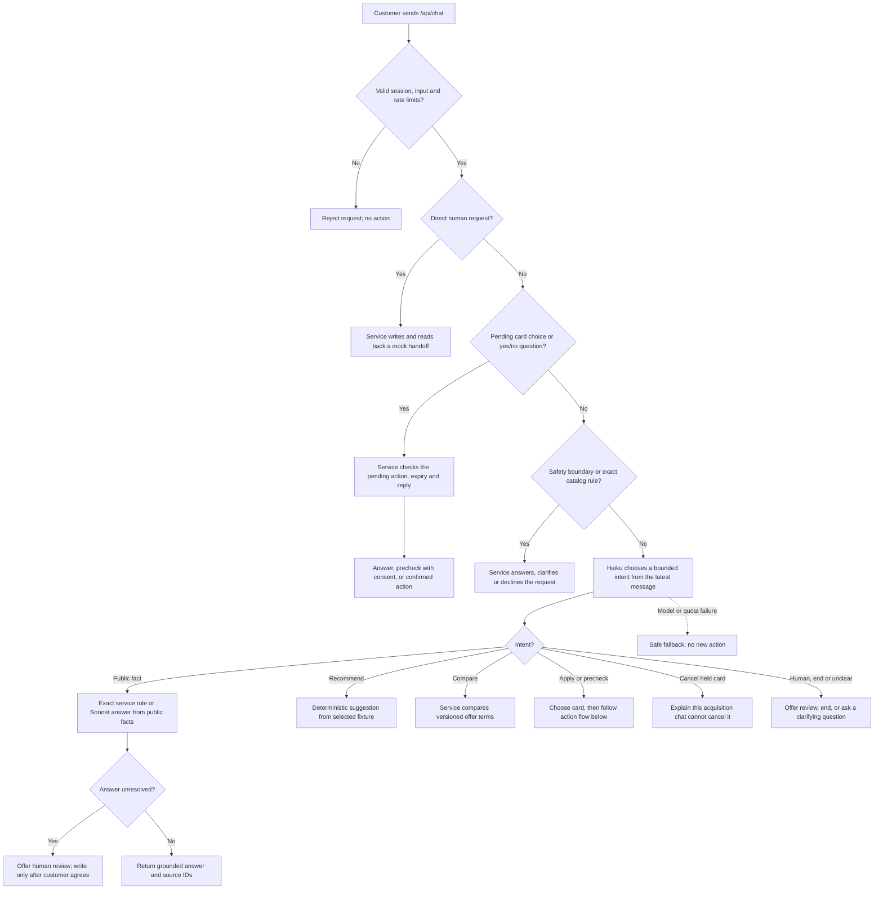
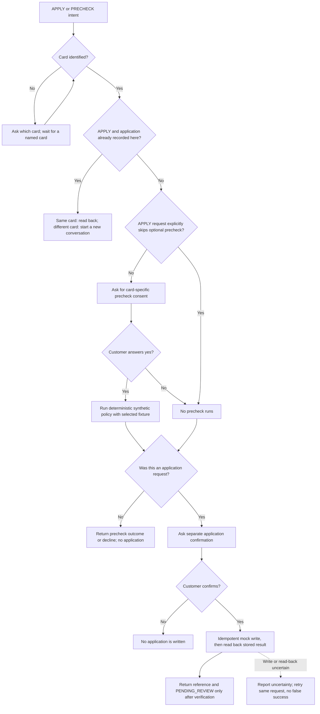

# What happens when a customer sends a message

This is the hosted `/api/chat` flow. The [architecture diagram](architecture.svg)
shows components; this page shows **routing decisions**. The browser first has
to start a session and select one of the fictional demo customers. The service
keeps that selection, the active card, pending questions, and any stored mock
application. A typed message or campaign link cannot grant consent by itself.

Haiku returns a structured choice from `PUBLIC_FACT`, `RECOMMEND`, `COMPARE`,
`APPLY`, `PRECHECK`, `CANCEL_EXISTING`, `HUMAN`, `END`, or `CLARIFY`, plus a card
reference and comparison preferences. It sees the latest message, chat
language, country, and selected card. It does **not** receive the fictional
customer's score, income, or policy result. A model choice proposes a route;
the service decides what is permitted in the session. Some exact catalog facts
and safety boundaries are handled before classification. The offline CLI has
a legacy local router when no model key is configured.

## Application and precheck branch

A standalone `PRECHECK` request ends after its consented policy result. For an
`APPLY` request, declining the optional precheck still leads to a **separate**
application confirmation. A second application for a different card requires
a new conversation; product questions and standalone prechecks can continue.
The synthetic policy never approves credit.

The current router can still make mistakes. In the [4 October live
checks](live_conversation_checks_2026-10-04.md), a cheaper-card request after
discussing two cards did not reliably clarify the price reference. The tree
describes the service's control flow, not a guarantee that every model intent
choice or product answer is correct.

Implementation: [browser service](../advisor/web.py), [intent and answer
service](../advisor/service.py), [synthetic policy](../advisor/session.py), and
[mock-action storage](../advisor/aws_state.py).
